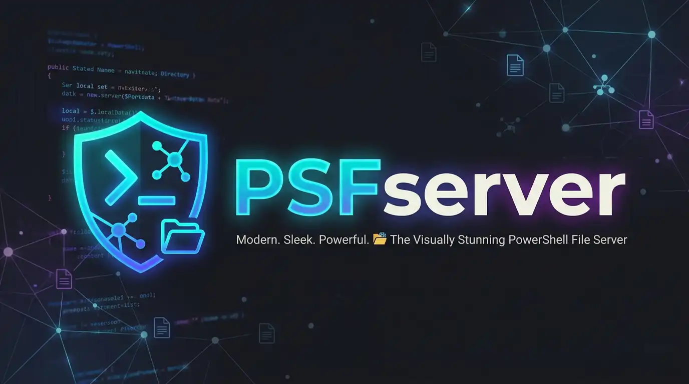

# PSFserver



A lightweight, zero-dependency HTTP file server for Windows written in PowerShell. Serves any directory over HTTP with a clean dark web interface — perfect for local development, LAN file sharing, and quick one-off transfers.

---

A lightweight, zero-dependency HTTP file server for Windows written in PowerShell. Serves any directory over HTTP with a clean dark web interface — useful for local development, LAN file sharing, and quick one-off transfers.

---


## Features

- **Directory browser** — clean, responsive web UI with dark theme
- **File downloads** — correct MIME types for 50+ file extensions
- **Live search** — filter files instantly by name
- **Sorting** — sort by name, size, or date modified
- **File uploads** — drag-and-drop or click-to-select (optional, `‑AllowUpload`)
- **Basic Auth** — password-protect the entire server (`‑Auth`)
- **Hidden files** — optionally show hidden/system files (`‑ShowHidden`)
- **Request logging** — timestamped console logs with IP and method (`‑LogRequests`)
- **Path traversal protection** — all requests are validated against the root directory
- **No dependencies** — uses only built-in .NET classes and PowerShell

---


## Requirements

- Windows with PowerShell 5.1 or PowerShell 7+
- Administrator privileges (required to bind an HTTP listener)

---


## Quick Start

### 1. Download & Extract

Clone or download this repository. Place the files anywhere you want to serve.

### 2. Run the Server

Open PowerShell **as Administrator** and run:

```powershell
# Serve the current directory on port 8080
./psfserver.ps1
```

Or specify a folder and port:

```powershell
./psfserver.ps1 -Path "C:\Projects" -Port 9000
```

### 3. Access in Browser

Open [http://localhost:8080](http://localhost:8080) in your browser. The web UI will show your files and folders.

---


## Parameters

| Parameter      | Type     | Default           | Description                                      |
|---------------|----------|-------------------|--------------------------------------------------|
| `-Path`       | string   | Current directory  | Directory to serve                               |
| `-Port`       | int      | 8080              | Port to listen on                                |
| `-Title`      | string   | FileServe         | Server name shown in the UI and header            |
| `-AllowUpload`| switch   | off               | Enable file uploads via drag-and-drop or picker   |
| `-ShowHidden` | switch   | off               | Include hidden/system files in listings           |
| `-LogRequests`| switch   | off               | Print each request to console with timestamp/IP   |
| `-OpenBrowser`| switch   | off               | Automatically open browser on startup             |
| `-Auth`       | string   | ""                | Enable HTTP Basic Auth. Format: "username:password"|
| `-MaxUploadMB`| int      | 100               | Maximum allowed upload size (MB)                  |

---


## Usage Examples

**Share a folder on your local network:**
```powershell
./psfserver.ps1 -Path "D:\Shared" -Port 8080
```

**Enable uploads with a 500 MB limit:**
```powershell
./psfserver.ps1 -AllowUpload -MaxUploadMB 500
```

**Password-protected server with request logging:**
```powershell
./psfserver.ps1 -Auth "alice:s3cr3t" -LogRequests
```

**Full example — custom title, uploads, hidden files, auto-open:**
```powershell
./psfserver.ps1 `
  -Path "C:\Projects" `
  -Port 3000 `
  -Title "Dev Server" `
  -AllowUpload `
  -ShowHidden `
  -LogRequests `
  -OpenBrowser
```

---


## Running as Administrator

PSFserver requires administrator privileges to bind an HTTP listener. Right-click PowerShell and choose **Run as Administrator**, then run the script.

Alternatively, register a URL reservation to avoid needing admin rights every time:

```powershell
# Run once as Administrator to reserve the URL
netsh http add urlacl url="http://+:8080/" user="DOMAIN\YourUsername"
```

After that, the script can be run as a normal user for that specific port.

---


## MIME Type Support

FileServe maps 50+ extensions to the correct Content-Type header so browsers open files natively rather than triggering unnecessary downloads.

| Category   | Extensions |
|------------|------------|
| Web        | .html .css .js .json .xml .svg |
| Images     | .png .jpg .gif .webp .bmp .ico |
| Video      | .mp4 .webm .avi .mov .mkv |
| Audio      | .mp3 .wav .ogg .flac .aac |
| Documents  | .pdf .txt .md .csv .log |
| Archives   | .zip .gz .tar .7z .rar |
| Code       | .py .go .rs .ts .java .c .cpp .cs .rb .php .ps1 .sh |
| Config     | .yaml .toml .ini .conf |
| Fonts      | .woff .woff2 .ttf |

Unknown extensions fall back to `application/octet-stream`.

---


## Security Notes

- **Path traversal** — all requests are resolved and validated against the root path before serving. Requests that escape the root are rejected with `403 Forbidden`.
- **Auth is HTTP Basic** — credentials are sent in plain text. Do not expose the psfserver to the public internet without a reverse proxy handling TLS.
- **Upload filenames** — uploaded filenames are validated to block characters that could lead to path injection (`/ \ : < > " | ? *`).
- **Upload size** — requests exceeding `-MaxUploadMB` are rejected with `413 Request Entity Too Large`.

---


## Stopping the Server

Press `Ctrl+C` in the terminal window where the server is running. The listener is stopped and disposed cleanly in a `finally` block.

---

## Winget Portable

Currently the project is under review for installation through winget. For development and upload to winget repository the `psfserver.go` can be compiled to .exe using :

```go
go build -o psfserver.exe psfserver.go
```

The `psfserver.go` file is a wrapper for the actaull `psfserver.ps1` script. It runs the `psfserver.ps1` script and transfers all of the arguments to it as well. 

This is done for complience with 
`winget` packages structure.

Later the `psfserver.exe` can be used to directly run the **PSFServer**. 

> NOTE: the `psfserver.exe` and `psfserver.ps1` should exist on the same folder AND shell be executed with admin previlages.

## License

MIT — do whatever you want with it.